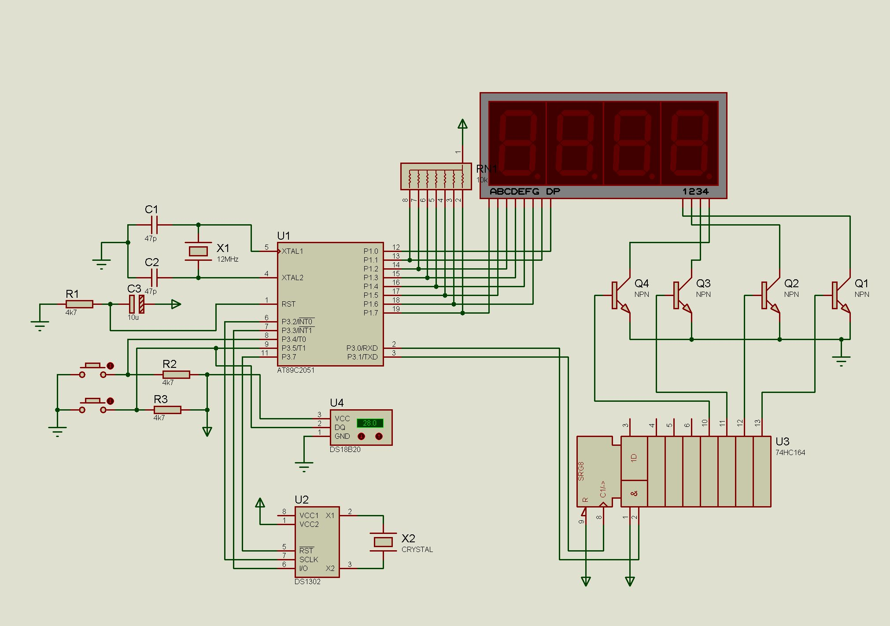
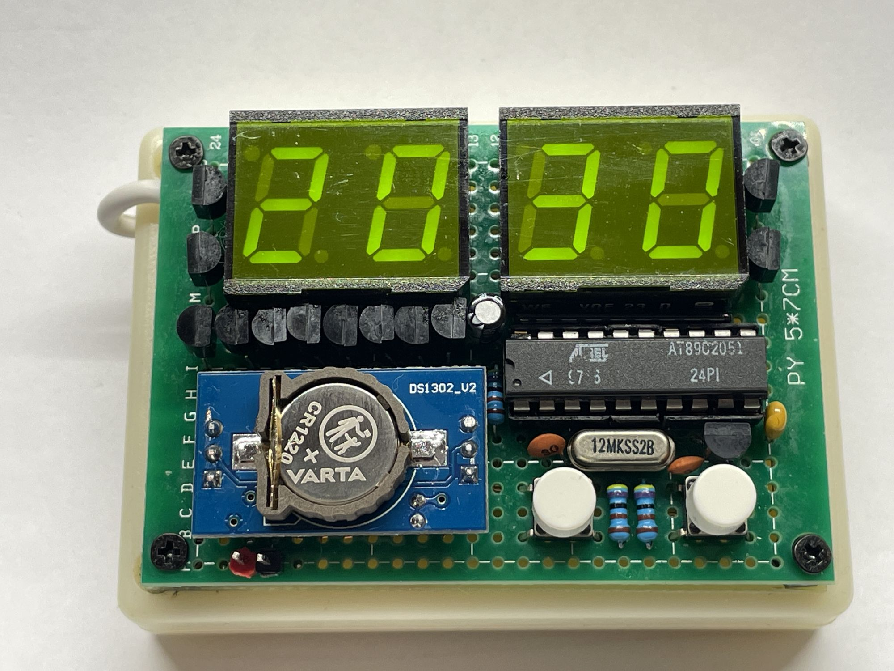
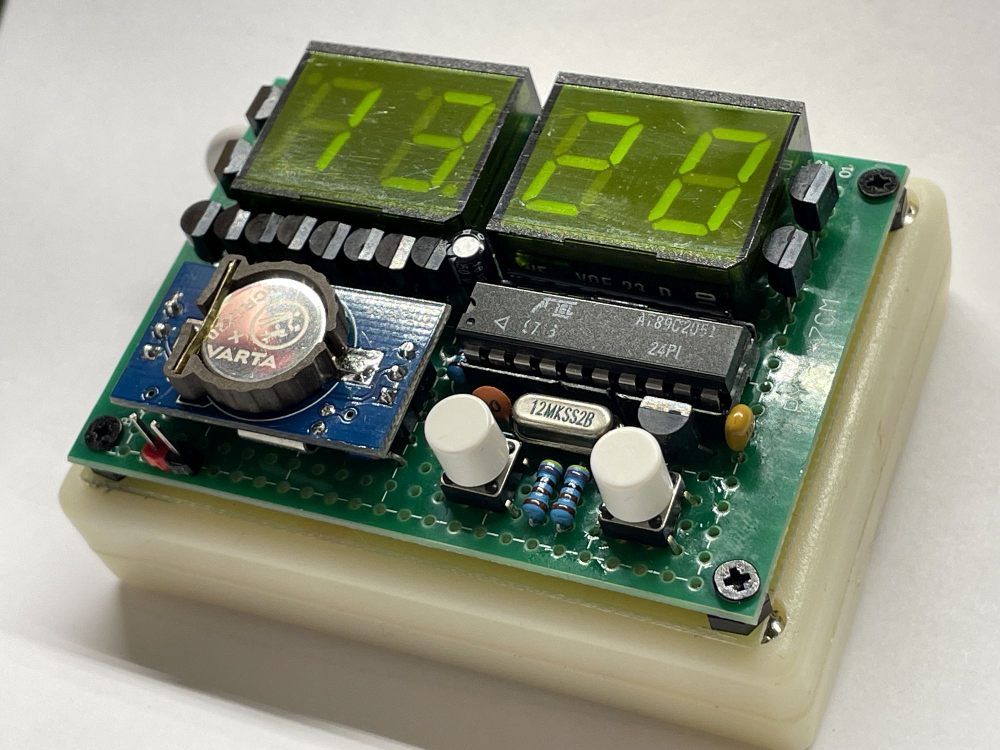

# AT89C2051 Digital Clock with DS18B20 Temperature Sensor

I have never worked with this retro MCU before. Recently, while going through some old stock, I discovered this worn-out poor broken leg MCU, a few Czechoslovak-made displays, and other vintage garbage. That sparked my interest in doing some retro programming - and that’s how this rather unnecessary project came to life.

---

## Hardware

| Component | Role |
|-----------|------|
| AT89C2051 | Main MCU, 12MHz crystal |
| DS1302 | Real-time clock (battery-backed) |
| DS18B20 | 1-Wire digital temperature sensor |
| 4-digit 7-segment display | Time / Temperature Display |
| 74HC164 shift register | Drives digit selection |
| 2× tactile buttons | User input (BTN1 on P3.4, BTN2 on P3.5) |

> **Note:** BTN2 and the DS18B20 data line share pin **P3.5**. Button reading is disabled during 1-Wire communication to avoid conflicts.

---

## Pin Map

```
P1.0–P1.7  →  7-segment segment data (direct)
P3.0       →  Shift register DATA (SR)
P3.1       →  Shift register CLK  (SR)
P3.2       →  DS1302 SCLK
P3.3       →  DS1302 IO
P3.4       →  Button 1
P3.5       →  Button 2 / DS18B20 DQ (shared)
P3.7       →  DS1302 CE
```

## Schematic


---
## Features

- **Real-time clock** via DS1302 — time is preserved across power cycles by a backup battery
- **Temperature measurement** via DS18B20 — displays temperature with one decimal place (e.g. `23.5 C`), including negative values
- **CRC8 verification** of DS18B20 scratchpad — invalid readings are discarded and shown as `----`
- **5 display modes** cycled by buttons:

| Mode | Display | How to enter |
|------|---------|--------------|
| `NORMAL` | `HH:MM` (hours : minutes) | default / after edit |
| `MIN_SEC` | `MM:SS` (minutes : seconds) | short press BTN2 |
| `TEMPERATURE` | `XX.X C` | short press BTN1 |
| `EDIT_HOUR` | blinking hours | long press BTN1 |
| `EDIT_MIN` | blinking minutes | BTN1 while in EDIT_HOUR |

---

## Button Controls

| Button | Press type | Action |
|--------|-----------|--------|
| BTN1 | Short press | Switch to temperature display |
| BTN1 | Long press (~2s) | Enter time edit mode |
| BTN1 | Press in edit | Confirm / next field |
| BTN2 | Short press | Switch to MM:SS view |
| BTN2 | Press in edit | Increment value (+1) |
| BTN2 | Hold in edit | Fast increment (auto-repeat) |

---

## How It Works

### Timekeeping
Timer0 generates a periodic interrupt (~50ms). Each ISR tick handles button debouncing, edit-mode blink timing, and auto-repeat for held buttons. The actual time is read from the DS1302 RTC over a 3-wire serial interface on every main loop iteration.

### Display Multiplexing
The 4-digit display is driven by multiplexing — each digit is lit for ~1ms in sequence inside `display_update()`, called once per main loop pass. During DS18B20 conversion (up to ~800ms), `display_update()` is called inside the polling loop so the display stays lit without blanking.

### Temperature Reading
1. A **Convert T** command (`0x44`) is issued to the DS18B20 over 1-Wire
2. The MCU polls the line while refreshing the display — conversion typically completes in under 200 cycles (~800ms timeout)
3. All **9 bytes** of the scratchpad are read and verified with **CRC8** (Dallas/Maxim, polynomial 0x31)
4. If CRC fails, the previous valid reading is discarded and `----` is shown

### Time Editing
Long-pressing BTN1 enters `EDIT_HOUR` mode. The currently edited field blinks at ~300ms. BTN2 increments the value; holding BTN2 triggers auto-repeat every ~250ms. Pressing BTN1 advances to minutes, then saves to DS1302 and returns to normal display.

---

## How It Looks
 

---

## Build

Developed and compiled with **Keil µVision** (C51 compiler) targeting AT89C2051.

- Source: single file `main.c`
- Flash usage: ~1940 bytes out of 2048, fits with ~100 bytes to spare :)

---

## License

MIT — free to use, modify, and distribute.
